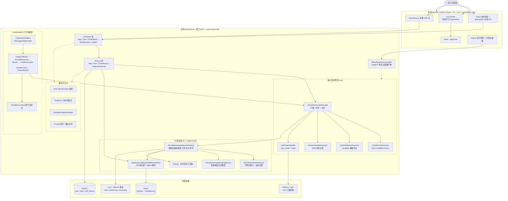
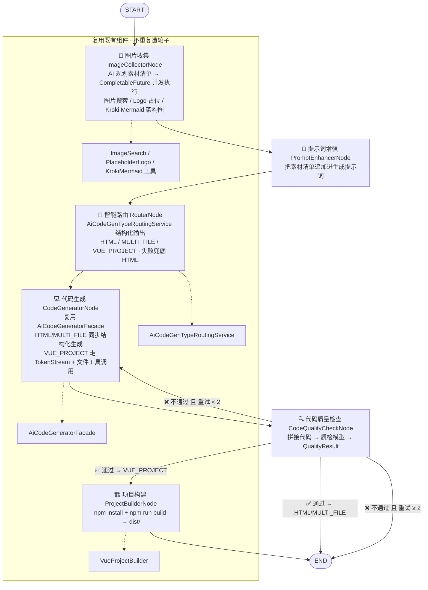

<div align="center">

# 🚀 AI-Code-Generate · 大模型驱动的全自动代码生成平台

> 一句话描述：**输入一句话，AI 从零为你写出一个可运行、可预览、可部署、可下载的前端项目** —— 从单页 HTML 到完整 Vue 工程，一条流水线全自动完成。

[](https://www.oracle.com/java/)
[](https://spring.io/projects/spring-boot)
[](https://vuejs.org/)
[](https://www.typescriptlang.org/)
[](https://github.com/langchain4j/langchain4j)
[](https://github.com/bsorrentino/langgraph4j)
[](https://github.com/mybatis-flex/mybatis-flex)
[](https://vite.dev/)
[](https://next.antdv.com/)
[](https://opensource.org/licenses/MIT)

**如果你觉得这个项目有帮助，欢迎点亮 ⭐ Star，让更多人看到它 🙌**

</div>

---

## 📖 目录

- [✨ 项目亮点](#-项目亮点)
- [🎯 核心功能](#-核心功能)
- [🏗️ 系统架构](#️-系统架构)
- [🔁 AI 代码生成工作流（LangGraph4j）](#-ai-代码生成工作流langgraph4j)
- [💡 核心技术 & 设计亮点](#-核心技术--设计亮点)
- [🛠️ 技术栈](#️-技术栈)
- [📁 项目结构](#-项目结构)
- [🚀 快速开始](#-快速开始)
- [📚 接口文档](#-接口文档)
- [🗺️ Roadmap](#️-roadmap)
- [🤝 参与贡献](#-参与贡献)

---

## ✨ 项目亮点

面向**面试官 / 技术评审**的设计要点，一句话一个亮点：

| # | 亮点 | 说明 |
|---|------|------|
| 🧠 | **LangGraph4j 图工作流编排** | 不满足于"一问一答"的 LLM 调用，用 **LangGraph4j + MessagesStateGraph** 把"图片收集 → 提示词增强 → 智能路由 → 代码生成 → 代码质检 → 项目构建"编排成**有状态、有条件边、有回环重试**的 Agent 工作流，质检不过自动回到生成节点重新生成（最多 2 次）。 |
| 🗂️ | **声明式 AI 服务 + 动态代理工厂** | 基于 **LangChain4j AiServices**，`AiCodeGeneratorService` 接口零实现类，运行时动态生成代理；按生成类型自动装配不同的模型、工具、记忆与护栏。 |
| 🎨 | **三种生成模式自适应** | `原生 HTML / 原生多文件 / Vue 工程` 三种模式，由 AI 路由节点智能选择；Vue 工程模式挂载 **5 个文件读写工具**（Write/Read/Modify/Delete/DirRead），LLM 通过**工具调用逐文件落盘**，完成后自动 `npm install + build`。 |
| ⚡ | **Reactor + SSE 全链路流式** | 前端 EventSource 消费后端 `Flux<ServerSentEvent>`，代码逐 token 打字机输出；Vue 模式下还能实时推送**工具调用进度**（Thinking / ToolCall / ToolResult）。 |
| 🛡️ | **AI 安全与成本控制体系** | 输入侧 **PromptSafetyInputGuardrail**（防注入 / 敏感词 / 超长）、输出侧 **RetryOutputGuardrail**、**Redisson 分布式令牌桶限流**（按用户 / IP / API 三级）、幻觉工具调用兜底。 |
| 🧠💾 | **DB 事实源 + Redis 缓存的对话记忆** | `DatabaseLoadingChatMemoryStore`：**写先落 DB 再写 Redis，读优先 Redis，缺失即从 DB 恢复**，多轮连续生成上下文不丢、不漂移；按 `AppChatMemoryId(appId, userId)` 隔离。 |
| 🔧 | **设计模式集大成** | 门面 `AiCodeGeneratorFacade`、策略 `CodeParserExecutor / CodeFileSaverExecutor / StreamHandlerExecutor`、模板方法 `CodeFileSaverTemplate`、工厂 `AiCodeGeneratorServiceFactory`、AOP 鉴权 `@AuthCheck`。 |
| 🏆 | **精选应用 Redis 缓存** | `@Cacheable` + 确定性缓存 Key 工具，应用广场首页热数据命中缓存，降低 DB 压力。 |

---

## 🎯 核心功能

- 📝 **应用（App）管理**：用户注册"应用"并填写初始化 Prompt，管理自己的应用列表（增删改查），管理员可管理全部应用。
- 💬 **AI 对话式生成代码**：在应用内连续对话，AI 根据对话历史（多轮记忆）持续迭代生成/修改代码。
- 🖥️ **三种生成模式**：
  - `原生 HTML` —— 单文件落地，开箱即用；
  - `原生多文件` —— 拆分为 `index.html / style.css / script.js`；
  - `Vue 工程` —— 完整 Vue3 工程化项目，工具调用逐文件生成 + 自动构建。
- 👁️ **实时预览**：生成的代码通过 `/api/static/**` 静态资源服务直接 iframe 预览。
- 📦 **一键部署**：生成 → 部署 → 获得可访问 URL，前后端分离的完整闭环。
- ⬇️ **下载源码**：将生成的项目整体打包为 **zip** 下载到本地。
- ✏️ **可视化编辑**：iframe 内选中元素自动生成 Prompt，引导 AI 定向修改。
- 👑 **用户体系**：注册 / 登录 / 角色（user / admin）、`@AuthCheck` 注解鉴权 + 前端路由守卫双保险。
- 🛡️ **分布式限流**：Redisson 令牌桶，防刷防滥用，保护 AI 成本。

---

## 🏗️ 系统架构

```
┌─────────────────────────── 前端 Vue3 + TypeScript + Vite ───────────────────────────┐
│  Vue Router (导航守卫 login/admin)  ·  Pinia · Axios · EventSource(SSE) · iframe 预览  │
│  AppChatPage 可视化编辑 · openapi2ts 自动生成的 TS API 客户端                          │
└──────────────┬────────────────────────────────────────────────────────────────────┘
               │ REST + SSE
┌──────────────▼────────────────────────── 后端 Spring Boot (8123 /api) ──────────────┐
│  Controller  AppController · UserController · ChatHistoryController                 │
│              StaticResourceController · WorkflowSseController · HealthController     │
│  Service     AppService · UserService · ChatHistoryService · ProjectDownloadService │
│  Core  ┌─ AiCodeGeneratorFacade (门面: 同步/流式 生成+保存)                          │
│        ├─ CodeParserExecutor     → HtmlCodeParser / MultiFileCodeParser            │
│        ├─ CodeFileSaverExecutor  → Html / MultiFile SaverTemplate (模板方法)        │
│        ├─ StreamHandlerExecutor  → SimpleText / JsonMessage Handler                │
│        └─ VueProjectBuilder      → npm install + build                             │
│  AI    AiCodeGeneratorService(声明式) · Factory(动态代理) · RoutingService           │
│        DatabaseLoadingChatMemoryStore(DB+Redis) · FileTools · Guardrails           │
│  LangGraph4j  CodeGenWorkflow · 6 Nodes · WorkflowContext · 图片/质检 AI + 工具       │
│  横切  AOP @AuthCheck · GlobalExceptionHandler · Redisson 限流 · CORS/JSON/Redis 配置 │
└──────┬──────────────────────┬──────────────────────┬───────────────────────────────┘
       ▼                      ▼                      ▼
     MySQL                 Redis                  LLM / 外部服务
  user·app·chat_history   Session(30天)+ChatMemory   OpenAI兼容 · 图片搜索 · Node/npm
```

### Mermaid 架构图



---

## 🔁 AI 代码生成工作流（LangGraph4j）

工作流不再是"提问 → 回答"的线性调用，而是一个**有状态、可回环、条件路由**的 Agent 图：



> 执行过程通过 **SSE 事件**（`workflow_start` / `step_completed` / `workflow_completed` / `workflow_error`）实时推送到前端；`CodeGenWorkflow#getMermaidGraph()` 甚至可以动态输出工作流图本身。

### 传统 SSE 对话链路（老链路）

```mermaid
sequenceDiagram
    participant FE as 前端 AppChatPage
    participant C as AppController /app/chat/gen/code
    participant S as AppService.chatToGenCode
    participant F as AiCodeGeneratorFacade
    participant AI as AiCodeGeneratorService 代理
    participant M as DatabaseLoadingChatMemoryStore
    participant P as CodeParserExecutor
    participant V as CodeFileSaverExecutor

    FE->>C: GET /api/app/chat/gen/code (SSE)
    C->>S: chatToGenCode(appId, message, user)
    S->>M: 初始化 AppChatMemoryId(appId, userId)
    S->>F: generateAndSaveCodeStream(message, type, memoryId)
    F->>AI: 按类型创建代理 (VUE_PROJECT 挂文件工具+推理模型)
    AI->>M: 读写多轮记忆 (DB 事实源 → Redis 缓存)
    AI-->>F: 流式返回 (HTML/MULTI_FILE: 文本 · VUE_PROJECT: TokenStream+工具)
    F-->>S: Flux&lt;String&gt;
    S-->>FE: SSE 逐 token 输出 (d: chunk / done: [DONE])
    Note over F,P,V: 流结束后
    F->>P: 解析完整代码
    F->>V: 保存到 tmp/code_output/&lt;type&gt;_&lt;appId&gt;/
    Note over F,P,V: 结构化解析失败 → 无记忆 raw 文本兜底
```

---

## 💡 核心技术 & 设计亮点

### 1️⃣ 分层架构 & 设计模式

| 模式 | 落地位置 | 说明 |
|------|---------|------|
| **门面模式 (Facade)** | `AiCodeGeneratorFacade` | 对外暴露统一的"生成+保存"入口，屏蔽 AI 调用 / 解析 / 落盘的复杂度；同步 / 流式双通道。 |
| **策略模式 (Strategy)** | `CodeParserExecutor` / `CodeFileSaverExecutor` / `StreamHandlerExecutor` | 按 `CodeGenTypeEnum` 运行时分派到 `Html` / `MultiFile` / `Vue` 具体实现，新增类型零侵入。 |
| **模板方法模式 (Template)** | `CodeFileSaverTemplate` | 固定"建目录 → 写文件 → 返回路径"骨架，子类只实现差异步骤。 |
| **工厂模式 (Factory)** | `AiCodeGeneratorServiceFactory` | 按生成类型装配不同的 ChatModel / StreamingModel / 工具 / 护栏 / 记忆策略。 |
| **AOP 面向切面** | `@AuthCheck` + `AuthInterceptor`、`@RateLimit` + `RateLimitAspect` | 鉴权与限流声明式解耦，业务代码无侵入。 |

### 2️⃣ Agent 化：从"单次调用"到"图工作流"

- 引入 **LangGraph4j**（LangGraph 的 Java 版）编排 **6 个有状态节点**；
- 支持**条件边**（质检通过/失败/是否构建）与**回环边**（质检失败回到生成节点自动重试）；
- 节点刻意**复用既有组件**（Facade / Router / Builder），不重写业务，保证两种链路行为一致。

### 3️⃣ 全链路容错与兜底

| 场景 | 兜底策略 |
|------|---------|
| 结构化输出解析失败 | 无记忆 raw 文本 + 本地 `CodeParser` 二次解析 |
| 工作流路由模型异常 | 默认退回 HTML 模式，保证流程不断 |
| 代码质检失败 | 自动携带"错误列表 + 修复建议"回到生成节点重试（≤ 2 次） |
| 质检服务自身异常 | 放行，不阻塞主流程 |
| 模型幻觉调用不存在工具 | 返回明确 tool error 而非中断 |

### 4️⃣ AI 安全 & 成本治理

- **输入护栏**：Prompt 长度上限 1000 字、敏感词、Prompt 注入正则（`ignore previous instructions` 等）；
- **输出护栏**：结构化校验失败自动重试；
- **分布式限流**：Redisson `RRateLimiter` 令牌桶，支持 `API / USER / IP` 三种维度（未登录自动降级 IP 限流），`AI 对话 5 次/分钟/用户`；
- **幻觉工具兜底** + **工具调用次数上限 20**，防止成本失控。

### 5️⃣ 高可用记忆设计

- **DB 为事实源，Redis 为缓存**：`写先落 DB 再写 Redis`，`读优先 Redis`，缺失/不一致自动从 DB 恢复；
- **多租户隔离**：`AppChatMemoryId(appId, userId)` 维度隔离上下文，不同应用/用户互不污染；
- **消息窗口**：最多保留 20 条，控制 Token 成本；
- 工具调用产生的运行时消息（ToolExecutionResult 等）不落业务历史表，保持对话干净。

---

## 🛠️ 技术栈

### 后端
| 技术 | 版本 | 用途 |
|------|------|------|
| Java | 21 | 语言（虚拟线程 / 模式匹配） |
| Spring Boot | 3.5.13 | Web 框架 / IOC / AOP |
| LangChain4j | 1.15.0 | LLM 抽象层（声明式 AI 服务 / 工具调用 / 护栏 / 记忆） |
| LangGraph4j | 1.6.0-rc2 | Agent 图工作流编排（MessagesStateGraph） |
| MyBatis-Flex | 1.11.0 | 轻量 ORM + 代码生成器 |
| WebFlux / Reactor | - | 响应式流式输出（SSE） |
| Redisson | 3.50.0 | 分布式限流（令牌桶） |
| Spring Session Data Redis | - | 分布式会话（30 天 TTL） |
| Knife4j | 4.4.0 | OpenAPI3 中文接口文档 |
| Hutool | 5.8.38 | 工具库 |

### 前端
| 技术 | 版本 | 用途 |
|------|------|------|
| Vue | 3.5 | UI 框架 |
| TypeScript | 5.8 | 类型安全 |
| Vite | 7 | 构建工具 |
| Ant Design Vue | 4.2 | 组件库 |
| Pinia | 3 | 状态管理 |
| Vue Router | 4.5 | 路由 + 导航守卫 |
| markdown-it + highlight.js | - | 对话 Markdown 渲染 + 代码高亮 |

### 存储
- **MySQL** `ai_code_generate`：`user` / `app` / `chat_history`（复合索引 `(appId, createTime)` 支持游标分页）
- **Redis**：Spring Session（30 天）+ AI 对话记忆缓存

---

## 📁 项目结构

```
ai-code-generate/
├── pom.xml                              # Spring Boot 3.5 / LangChain4j / LangGraph4j / MyBatis-Flex
├── sql/create_table.sql                 # user / app / chat_history 建表脚本
├── docs/                                # 架构总结 + 工作流设计文档
├── src/main/java/com/xhl/aicodegenerate/
│   ├── controller/                      # App / User / ChatHistory / Static / WorkflowSse / Health
│   ├── service/ + impl/                 # 业务逻辑
│   ├── core/                            # AiCodeGeneratorFacade + parser/ + saver/ + handler/ + builder/
│   ├── ai/                              # 声明式 AI 服务 + 工厂 + 记忆存储 + 文件工具 + 护栏
│   ├── langgraph4j/                     # CodeGenWorkflow + node/ + state/ + ai/ + tools/
│   ├── ratelimit/                       # @RateLimit 注解 + Redisson AOP 限流
│   ├── entity/ mapper/                  # MyBatis-Flex 数据访问
│   ├── model/                           # dto/ vo/ enums/
│   ├── annotation/ aop/                 # @AuthCheck 鉴权
│   ├── common/ exception/ config/ constant/ utils/
│   └── generator/                       # MyBatis-Flex 代码生成工具（开发期）
├── src/main/resources/
│   ├── prompt/                          # html / multi-file / vue / routing / quality / image 提示词
│   └── application.yml                  # 端口 8123 / context-path /api
└── ai-code-frontend/                    # Vue3 + TS + Vite + Antd + Pinia
    └── src/
        ├── pages/                       # Home / app/* / user/* / admin/*
        ├── router/ stores/ request.ts   # 路由守卫 / 状态 / Axios
        ├── api/                         # openapi2ts 自动生成
        ├── components/ utils/           # AppChatComposer / visualEditor
        └── config/env.ts                # 预览 / 部署 URL 构造
```

---

## 🚀 快速开始

### 0️⃣ 前置环境

| 依赖 | 版本要求 | 说明 |
|------|---------|------|
| JDK | 21+ | `java -version` |
| Maven | 3.6+ | 项目自带 `./mvnw`，可免安装 |
| MySQL | 5.7+ / 8.x | 本地实例 |
| Redis | 6+ | 本地实例 |
| Node.js | 18+ | 前端构建 / Vue 工程自动构建 |
| LLM API Key | OpenAI 兼容 | 在 `application-local.yml` 配置 |

### 1️⃣ 初始化数据库

```bash
mysql -uroot -p < sql/create_table.sql
```

### 2️⃣ 配置 LLM 与本地环境

复制并编辑本地配置文件（已被 gitignore，不会泄露密钥）：

```bash
cp src/main/resources/application-local.yml.example src/main/resources/application-local.yml
# 编辑：MySQL 账号密码、Redis 连接、LLM API Key / BaseURL / 模型名（chat / streaming / routing）
# 提示：真实 Key 只写在被 gitignore 的 application-local.yml 中，不会提交到 GitHub
```

### 3️⃣ 启动后端

```bash
# 从项目根目录
./mvnw spring-boot:run
```

后端启动于 **http://localhost:8123/api**，接口文档见下方。

### 4️⃣ 启动前端

```bash
cd ai-code-frontend
yarn install      # 或 npm install
yarn dev          # Vite dev server（HMR）
```

浏览器访问 Vite 输出的地址（默认 http://localhost:5173）。

### 5️⃣ 测试

```bash
./mvnw test                 # 全部测试
./mvnw test -Dtest=XxxTest  # 单个测试类
./mvnw package -DskipTests  # 打包 JAR
```

### ⚙️ 常用脚本（前端）

```bash
yarn build          # 类型检查 + 生产构建
yarn lint           # ESLint 自动修复
yarn format         # Prettier
yarn openapi2ts     # 后端改动后重新生成 TS API 客户端
```

---

## 📚 接口文档

- **Knife4j / OpenAPI3 中文文档**：`http://localhost:8123/api/doc.html`
- **前端 API 客户端**：由 `yarn openapi2ts` 从后端 OpenAPI 规范自动生成（`ai-code-frontend/src/api/`）

### 核心接口速览

| 模块 | 接口 | 说明 |
|------|------|------|
| 用户 | `POST /api/user/register` · `/login` · `/logout` | 注册 / 登录 / 登出 |
| 应用 | `POST /api/app/add` · `/update` · `/delete` | 应用 CRUD |
| 生成 | `GET /api/app/chat/gen/code?appId&message` | **SSE 流式对话生成代码**（核心） |
| 部署 | `POST /api/app/deploy` | 一键部署，返回访问 URL |
| 下载 | `GET /api/app/download/{appId}` | 源码打包 zip 下载 |
| 工作流 | `POST /api/workflow/execute` · `GET /api/workflow/execute-flux` | **LangGraph4j 图工作流**（同步 / SSE） |
| 静态资源 | `GET /api/static/{deployKey}/**` | 预览 / 部署产物访问 |
| 健康检查 | `GET /api/health` | 存活探针 |

---

## 🗺️ Roadmap

- [x] 用户体系 + 角色鉴权（`@AuthCheck`）
- [x] 应用管理 + 精选广场 + Redis 缓存
- [x] 三种生成模式（HTML / MultiFile / Vue 工程）
- [x] SSE 流式生成 + 工具调用实时进度
- [x] 部署 / 下载 / 可视化编辑
- [x] LangGraph4j Agent 工作流（图片收集 → 质检 → 构建闭环）
- [x] AI 安全护栏 + Redisson 分布式限流
- [ ] Docker Compose 一键部署
- [ ] 生成结果自动截图 & 效果对比
- [ ] 更多工程化模板（React / 小程序）
- [ ] 模型多供应商适配（Qwen / DeepSeek / GLM…）

---

## 🤝 参与贡献

欢迎任何形式的贡献：提 Issue、修 Bug、加功能、完善文档。

1. **Fork** 本仓库
2. 创建你的分支：`git checkout -b feat/xxx`
3. **Commit** 你的改动（遵循 Conventional Commits）
4. **Push** 并提交 **Pull Request**

**给面试官 / 学习者的建议**：如果你想了解"如何把大模型调用工程化"，建议从这几个文件入手：

- `ai/AiCodeGeneratorServiceFactory.java` —— LangChain4j 动态代理 + 按类型装配
- `langgraph4j/CodeGenWorkflow.java` —— 图工作流 + 条件边 + 回环重试
- `core/AiCodeGeneratorFacade.java` —— 门面 + 流式 + 兜底
- `ai/DatabaseLoadingChatMemoryStore.java` —— DB 事实源 + Redis 缓存一致性
- `ratelimit/aspect/RateLimitAspect.java` —— 分布式限流 AOP

---

<div align="center">

**AI-Code-Generate** · Made with ❤️ by [sz-xiaohuolong](https://github.com/sz-xiaohuolong)

[MIT License](./LICENSE) · 欢迎 ⭐ Star 与 PR

</div>
