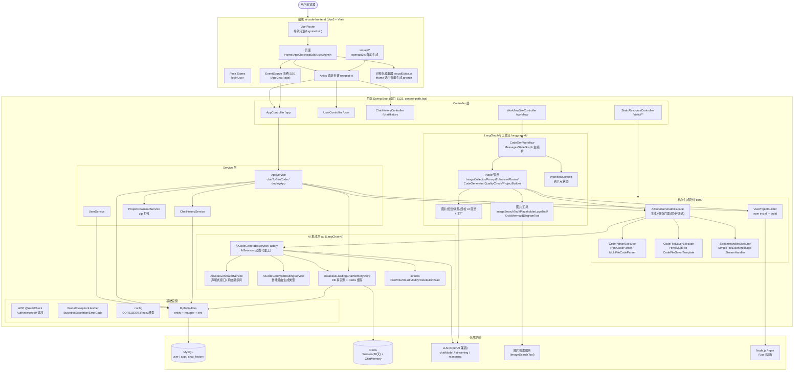
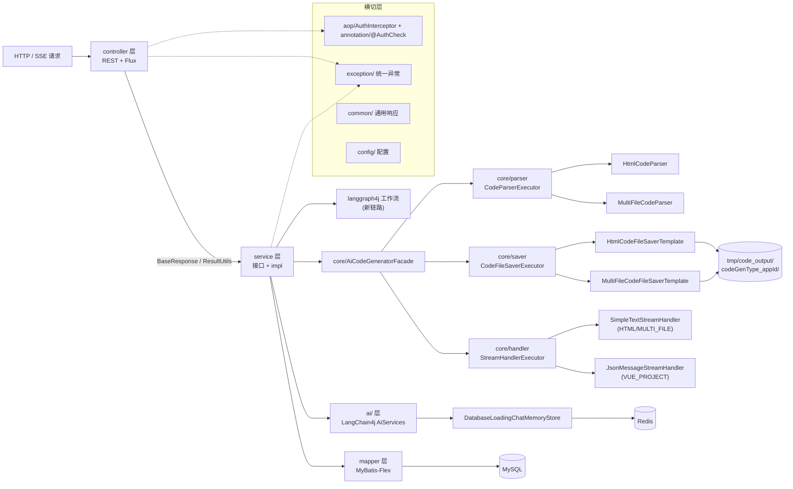
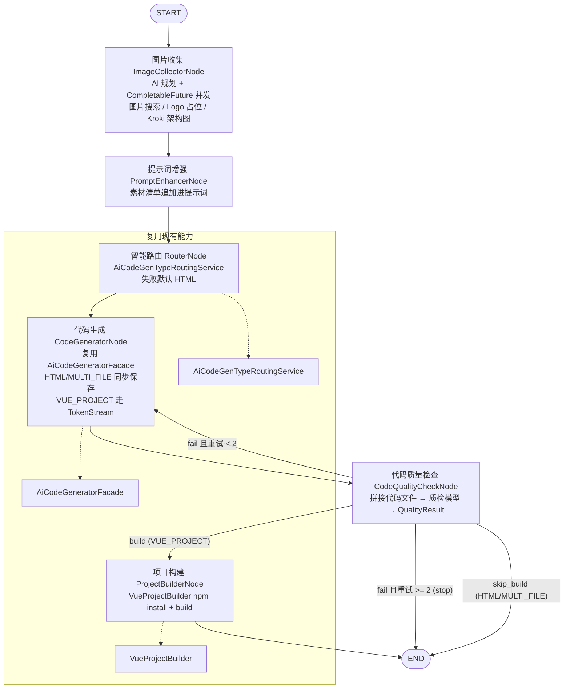
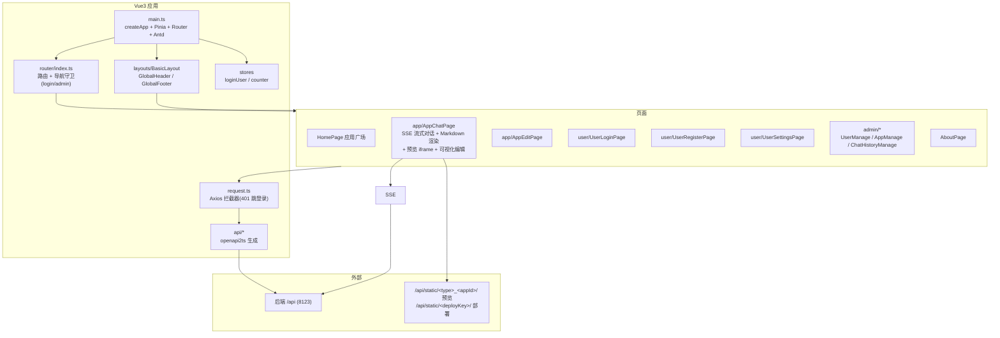

# AI 代码生成平台 —— 项目架构总结

> 基于源码阅读整理。后端 `src/main/java/com/xhl/aicodegenerate/`，前端 `ai-code-frontend/`。

## 1. 项目概览

AI 驱动的代码生成平台：用户注册"应用"（App）并填写提示词，系统选择生成类型（原生 HTML / 多文件 / Vue 工程），由大模型生成完整前端代码，代码落盘后可**预览**、**部署**、**下载**；对话历史持久化以支持多轮连续生成。

- **后端**：Java 21 · Spring Boot 3.5 · Maven · MyBatis-Flex ORM · LangChain4j（LLM 抽象）· LangGraph4j（图工作流编排）· WebFlux/Reactor（流式 SSE）
- **前端**：Vue 3 · TypeScript · Vite · Ant Design Vue · Pinia · Vue Router
- **存储**：MySQL（`ai_code_generate`：user / app / chat_history）+ Redis（Spring Session + AI 对话记忆缓存）

## 2. 系统总览架构图



## 3. 后端分层架构



## 4. 代码生成核心链路（Chat 路径，SSE）

前端 `AppChatPage` 通过 `EventSource` 调用 `GET /api/app/chat/gen/code?appId&message`，后端返回 SSE 流：

```mermaid
sequenceDiagram
    participant FE as 前端 AppChatPage.vue
    participant C as AppController /app/chat/gen/code
    participant S as AppService.chatToGenCode
    participant F as AiCodeGeneratorFacade
    participant AF as AiCodeGeneratorServiceFactory
    participant AI as AiCodeGeneratorService (LangChain4j 代理)
    participant M as DatabaseLoadingChatMemoryStore
    participant P as CodeParserExecutor
    participant V as CodeFileSaverExecutor
    participant DB as MySQL / Redis

    FE->>C: GET /api/app/chat/gen/code (SSE)
    C->>S: chatToGenCode(appId, message, user)
    S->>M: 初始化 AppChatMemoryId(appId, userId) 对话记忆
    S->>F: generateAndSaveCodeStream(message, type, memoryId)
    F->>AF: createAiCodeGeneratorService(memoryId, type)
    AF->>AI: 按类型创建代理<br/>(VUE_PROJECT 挂文件工具+推理模型)
    AI->>M: 读取/写入 ChatMemory (DB 事实源 → Redis 缓存)
    AI-->>F: 流式返回(HTML/MULTI_FILE: 文本; VUE_PROJECT: TokenStream+工具调用)
    F-->>S: Flux<String>
    S->>S: StreamHandlerExecutor 按类型选处理器
    S-->>FE: SSE 流 (d: chunk / done: [DONE])
    Note over F,P,V: 流结束后
    F->>P: 解析完整代码 (Html / MultiFile)
    F->>V: 保存到 tmp/code_output/&lt;type&gt;_&lt;appId&gt;/
    Note over S,DB: 失败时走"无记忆 raw 文本"兜底解析
```

## 5. LangGraph4j 工作流链路（新架构）

`WorkflowSseController (/workflow/execute | /execute-flux)` 驱动 `CodeGenWorkflow`，用 `MessagesStateGraph` 编排 6 个节点，`WorkflowContext` 在 `MessagesState` 中流转：



工作流执行结果（`generatedCodeDir` / `buildResultDir` / `errorMessage`）通过 SSE 事件（`workflow_start` / `step_completed` / `workflow_completed` / `workflow_error`）实时推送给前端；`CodeGenWorkflow#getMermaidGraph()` 还能动态输出图本身。

## 6. 前端架构



## 7. 数据存储设计

| 存储 | 用途 | 说明 |
| --- | --- | --- |
| MySQL `user` | 账号、角色（user/admin） | 密码、头像、简介 |
| MySQL `app` | 注册的应用 | `initPrompt`、`codeGenType`、`deployKey`（唯一）、`priority`（精选=99）、`userId` |
| MySQL `chat_history` | 对话历史 | `messageType`（user/ai）、`appId`、`userId`，复合索引 `(appId, createTime)` 支持游标分页 |
| Redis | Spring Session（30 天 TTL） | 登录态 |
| Redis | LangChain4j ChatMemory | `DatabaseLoadingChatMemoryStore` 包装：**写先落 DB 再写 Redis**；**读优先 Redis，缺失/不一致时从 DB 恢复**（DB 为事实源） |
| 文件系统 `tmp/code_output/<type>_<appId>/` | 生成代码 | 预览源 |
| 文件系统 `tmp/code_deploy/<deployKey>/` | 部署产物 | Vue 工程部署 `dist/` 目录 |

## 8. 关键设计要点

1. **双代码生成链路**：老链路（Chat SSE，按 App 类型直连 AI 服务）与新链路（LangGraph4j 图工作流）并存；工作流节点刻意**复用** `AiCodeGeneratorFacade`、`VueProjectBuilder`、`AiCodeGenTypeRoutingService` 等现有组件，而不是重写。
2. **策略/模板模式**：`CodeParserExecutor`、`CodeFileSaverExecutor`、`StreamHandlerExecutor` 都按 `CodeGenTypeEnum` 分派到具体实现；保存器基于模板方法（`CodeFileSaverTemplate`）。
3. **声明式 AI 服务**：`AiCodeGeneratorService` 等接口由 LangChain4j `AiServices` 在运行时生成动态代理，提示词放在 `src/main/resources/prompt/`；`VUE_PROJECT` 模式额外挂载文件读写工具（最多 20 次顺序工具调用），并切换到推理型流式模型。
4. **容错兜底**：结构化输出解析失败 → 走无记忆 raw 文本 + 本地 `CodeParser` 解析；工作流路由失败默认 HTML；质检失败最多重试 2 次；质检服务异常放行。
5. **记忆一致性**：ChatMemory 采用"DB 事实源 + Redis 缓存"，`AppChatMemoryId(appId, userId)` 隔离不同应用/用户的上下文；工具调用产生的运行时消息（ToolExecutionResult 等）不落业务历史表。
6. **鉴权**：后端 `@AuthCheck(mustRole=ADMIN_ROLE)` + AOP 拦截；前端路由守卫双保险；App 归属校验（本人或管理员）在 Service/Controller 层。
7. **可观测/文档**：Knife4j（`/api/doc.html`）；前端 API 客户端由 `yarn openapi2ts` 从 OpenAPI 规范自动生成。

## 9. 目录结构速览

```
ai-code-generate/
├── pom.xml                          # Spring Boot 3.5 / LangChain4j / LangGraph4j / MyBatis-Flex
├── sql/create_table.sql             # user / app / chat_history
├── src/main/java/com/xhl/aicodegenerate/
│   ├── controller/                  # App / User / ChatHistory / Static / Workflow / Health
│   ├── service/ + service/impl/     # 业务逻辑
│   ├── core/                        # AiCodeGeneratorFacade + parser/ + saver/ + handler/ + builder/
│   ├── ai/                          # LangChain4j 声明式服务 + 工厂 + 记忆存储 + 文件工具
│   ├── langgraph4j/                 # CodeGenWorkflow + node/ + state/ + ai/ + tools/ + model/
│   ├── entity/ mapper/              # MyBatis-Flex 数据访问
│   ├── model/                       # dto/ vo/ enums/
│   ├── annotation/ aop/             # @AuthCheck 鉴权
│   ├── common/ exception/ config/ constant/ utils/
│   └── generator/                   # MyBatis-Flex 代码生成工具(开发期)
├── src/main/resources/
│   ├── prompt/                      # codegen-html / multi-file / vue-project / routing / quality / image
│   └── application.yml / application-local.yml
└── ai-code-frontend/                # Vue3 + TS + Vite + Antd + Pinia
    └── src/
        ├── pages/                   # Home / app/* / user/* / admin/*
        ├── router/ stores/ request.ts
        ├── api/                     # openapi2ts 自动生成
        ├── components/ utils/       # AppChatComposer / visualEditor
        └── config/env.ts            # 预览/部署 URL 构造
```
