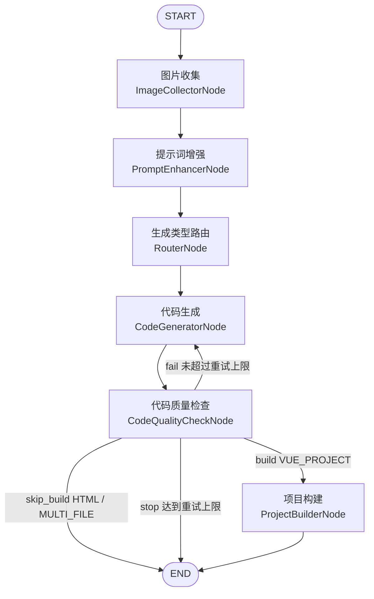
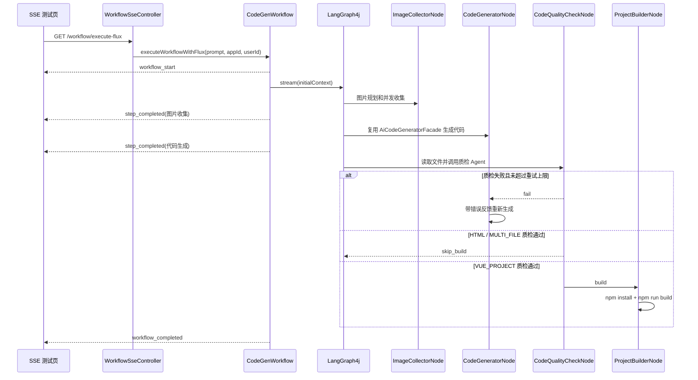

# LangGraph4j 工作流特性实战开发说明

本文档沉淀本次 LangGraph4j 工作流特性实战的开发逻辑，重点对应教程第五部分：条件边、循环边、并发图片收集、SSE 流式输出。

## 1. 本次目标

在已有 AI 代码生成工作流基础上继续增强：

1. HTML / MULTI_FILE 生成完成后跳过项目构建节点。
2. 代码生成后新增代码质量检查节点，检查失败时回到代码生成节点重新生成。
3. 图片收集节点改成“AI 规划 + CompletableFuture 并发执行 + 汇总结果”。
4. 新增 Flux SSE 输出能力，并提供一个简单测试页面。
5. 保持原来的代码生成门面、模型调用和保存路径规则，避免重写核心业务。

## 2. 总体流程



主编排类是 `CodeGenWorkflow`。它通过 `MessagesStateGraph` 定义节点和边，并把所有业务状态放在 `WorkflowContext` 里流转。

## 3. WorkflowContext 新增状态

本次新增了两个与质量检查有关的字段：

| 字段 | 作用 |
| --- | --- |
| `qualityResult` | 保存代码质检 Agent 的结构化结果 |
| `qualityCheckRetryCount` | 记录质检失败后的重新生成次数 |

已有字段继续复用：

| 字段 | 作用 |
| --- | --- |
| `appId` / `userId` | 用于隔离代码生成目录、Chat Memory 和本地素材目录 |
| `imageList` / `imageListStr` | 保存图片收集结果 |
| `enhancedPrompt` | 保存追加素材后的提示词 |
| `generationType` | 保存 HTML / MULTI_FILE / VUE_PROJECT 路由结果 |
| `generatedCodeDir` | 代码生成目录 |
| `buildResultDir` | 最终可预览或可部署目录 |
| `errorMessage` | 工作流执行中的错误信息 |

## 4. 条件边：跳过构建

代码位置：

- `CodeGenWorkflow#createWorkflow`
- ##### `CodeGenWorkflow#routeBuildOrSkip`
- `ProjectBuilderNode`

原来所有生成类型都会进入 `ProjectBuilderNode`。但 HTML 和 MULTI_FILE 在 `CodeGeneratorNode` 中已经完成文件保存，不需要 npm install / build。

现在逻辑是：

```java
case VUE_PROJECT -> "build";
case HTML, MULTI_FILE -> {
    context.setBuildResultDir(context.getGeneratedCodeDir());
    yield "skip_build";
}
```

因此：

- `VUE_PROJECT`：进入 `ProjectBuilderNode`，调用 `VueProjectBuilder.buildProject(...)`。
- `HTML` / `MULTI_FILE`：直接结束工作流，`buildResultDir = generatedCodeDir`。

这样减少无意义构建，也避免 HTML / 多文件项目被当成 Vue 项目执行 npm 命令。

## 5. 循环边：代码质量检查

新增文件：

- `CodeQualityCheckNode`
- `CodeQualityCheckService`
- `CodeQualityCheckServiceFactory`
- `QualityResult`
- `prompt/code-quality-check-system-prompt.txt`

代码生成节点完成后，工作流进入 `CodeQualityCheckNode`。

质检节点做三件事：

1. 读取 `generatedCodeDir` 下的代码文件。
2. 拼接成一段“项目文件结构和代码内容”。
3. 调用 `CodeQualityCheckService.checkCodeQuality(...)` 返回结构化 `QualityResult`。

`QualityResult` 格式：

```json
{
  "isValid": true,
  "errors": [],
  "suggestions": []
}
```

质检后的路由由 `routeAfterQualityCheck` 控制：

| 条件 | 下一步 |
| --- | --- |
| `isValid = true` 且 `VUE_PROJECT` | `build`，进入项目构建 |
| `isValid = true` 且 `HTML / MULTI_FILE` | `skip_build`，直接结束 |
| `isValid = false` 且未超过重试上限 | `fail`，回到代码生成节点 |
| `isValid = false` 且达到重试上限 | `stop`，结束并写入错误信息 |

回到代码生成节点时，`CodeGeneratorNode#buildUserMessage` 会把上次质检错误追加到用户提示词后面：

```text
## 上次生成的代码存在以下问题，请基于原需求重新生成并修复

### 错误列表
- ...

### 修复建议
- ...
```

这样下一轮生成会带着明确反馈，而不是盲目重新生成。

当前最大重试次数是 `MAX_QUALITY_RETRY_COUNT = 2`。

## 6. 图片收集优化：AI 规划 + 并发执行

新增或修改文件：

- `ImageCollectorNode`
- `ImageCollectionPlan`
- `ImageCollectionPlanService`
- `ImageCollectionPlanServiceFactory`
- `prompt/image-collection-plan-system-prompt.txt`

旧逻辑更接近“让 AI 服务自己调用工具收集图片”。新逻辑拆成两层：

1. AI 只负责规划。
2. Java 代码负责并发执行工具。

### 6.1 AI 规划

`ImageCollectionPlanService` 接收用户原始需求，输出结构化计划：

```json
{
  "contentImageTasks": [
    { "query": "现代企业办公 团队协作" }
  ],
  "diagramTasks": [
    {
      "mermaidCode": "flowchart TD\\nA[用户] --> B[系统]",
      "description": "系统架构图"
    }
  ],
  "logoTasks": [
    { "description": "通用企业品牌 Logo，现代简洁风格" }
  ]
}
```

Prompt 中要求：信息不足时不要反问，直接生成通用素材规划。

如果 AI 规划失败或返回空结果，`ImageCollectionPlan.defaultPlan(...)` 会兜底生成：

- 1 个通用 Logo 任务。
- 2 个通用内容图片搜索任务。

### 6.2 并发执行

`ImageCollectorNode#executeImageTasks` 会把计划拆成多个 `CompletableFuture`：

| 任务 | 工具 |
| --- | --- |
| `contentImageTasks` | `ImageSearchTool#searchContentImages` |
| `logoTasks` | `PlaceholderLogoTool#generateLogos` |
| `diagramTasks` | `KrokiMermaidDiagramTool#generateMermaidDiagram` |

所有任务并发启动：

```java
CompletableFuture.allOf(futures.toArray(new CompletableFuture[0])).join();
```

然后逐个汇总成功结果。某个图片任务失败只记录 warn，不中断整个工作流。

### 6.3 本地素材目录

没有 COS 时，本地生成的 SVG 素材保存到：

```text
tmp/code_output/workflow_assets/app_{appId}/
```

对外访问 URL：

```text
/api/static/workflow_assets/app_{appId}/{fileName}.svg
```

如果 `appId` 为空或小于等于 0，才会兜底到 `app_0`。

## 7. SSE 流式输出

新增文件：

- `WorkflowSseController`
- `src/main/resources/static/workflow-sse.html`

核心方法：

```java
Flux<String> executeWorkflowWithFlux(String originalPrompt, Long appId, Long userId)
```

它内部仍然执行同一套 LangGraph4j 工作流，只是在每个节点执行完成后向前端发送一个 SSE 事件。

事件类型：

| 事件 | 含义 |
| --- | --- |
| `workflow_start` | 工作流开始 |
| `step_completed` | 某个节点完成 |
| `workflow_completed` | 工作流完成 |
| `workflow_error` | 工作流异常 |

SSE 文本格式由 `CodeGenWorkflow#formatSseEvent` 统一生成：

```text
event: step_completed
data: {"stepNumber":1,"currentStep":"图片收集"}

```

测试页面访问路径：

```text
http://localhost:8123/api/workflow-sse.html
```

接口路径：

```text
GET /api/workflow/execute-flux?prompt=...&appId=...&userId=...
```

`appId` 和 `userId` 是可选参数。不传时会使用临时 appId，适合单纯测试；传入真实 appId 时，本地素材会进入对应的 `workflow_assets/app_{appId}` 目录。

## 8. 核心调用链



## 9. 测试说明

本次新增的轻量测试不依赖真实大模型：

```bash
./mvnw -Dtest=CodeGenWorkflowRoutingTest,ImageCollectionPlanTest,CodeQualityCheckNodeTest,WorkflowSseTest test
```

覆盖内容：

| 测试 | 覆盖点 |
| --- | --- |
| `CodeGenWorkflowRoutingTest` | 条件边和循环边路由 |
| `ImageCollectionPlanTest` | 图片规划兜底和空任务清理 |
| `CodeQualityCheckNodeTest` | 质检节点读取代码文件，跳过 dist / README 等非目标内容 |
| `WorkflowSseTest` | SSE 事件格式 |

完整编译：

```bash
./mvnw -DskipTests compile
```

真实工作流测试仍然在 `CodeGenWorkflowTest` 中，需要本地配置好数据库、Redis、模型 Key、Pexels Key 等外部依赖。

## 10. 审查重点

你明天验收时建议重点看：

1. `CodeGenWorkflow#createWorkflow`：图结构是否符合教程第五部分。
2. `routeAfterQualityCheck`：失败回路和最大重试次数是否符合预期。
3. `CodeQualityCheckNode`：读取哪些代码文件，是否跳过构建产物目录。
4. `ImageCollectorNode#executeImageTasks`：是否真的并发执行工具并汇总。
5. `WorkflowSseController` 和 `workflow-sse.html`：是否能实时看到节点完成事件。

整体上，这次改动没有替换原有 `AiCodeGeneratorFacade`、`CodeGenTypeEnum`、保存路径规则或 Vue 构建器，只是在 LangGraph4j 编排层增加了特性节点和边。
