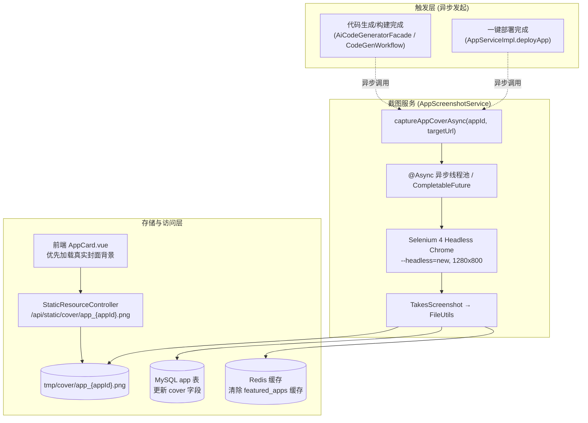

# Proposed Technical Design — app-cover-screenshot

## Control

- Proposal ID: `DESIGN-SCREENSHOT-001`
- Target Release: `app-cover-screenshot`
- Status: `APPROVED`
- Related REQ/AC: `REQ-001/AC-001`, `REQ-002/AC-002`, `REQ-003/AC-003`
- Related Decisions: `A1 双触发 / A2 渐进式 / A3 静默降级`
- Owner: `Antigravity Agent`
- Last Updated: `2026-09-26`

## Goal and Constraints

- Goal: 使用 Selenium 截取生成项目的网页渲染效果，生成真实封面，替换原本的科技感线框图占位。
- In Scope: Selenium 4 依赖集成、Chrome Headless 截图服务、静态资源路径扩展、生成/部署触发挂载、静默容错保护。
- Out of Scope: 批量扫描刷库历史应用、自定义上传封面。
- Constraints: 异步非阻塞执行；截图异常静默捕获不抛给前端。

## Proposed Architecture



## Interfaces and Compatibility

- Public APIs:
  - 静态资源路由扩展：`GET /api/static/cover/{fileName}` 返回图片媒体流（`image/png`）。
- Internal Contracts:
  - `AppScreenshotService.java`:
    ```java
    public interface AppScreenshotService {
        void captureAppCoverAsync(Long appId, String targetUrl);
    }
    ```
- Compatibility:
  - 数据库 `app` 表 `cover` 字段原本就存在（VARCHAR 512），无需变更 DDL。
  - 前端 `AppCard.vue` 本身已编写 `v-if="app.cover"` 渲染 `.real-cover` 的逻辑，天然向下兼容。

## Failure and Recovery

- Failure Modes:
  - 操作系统无 Chrome 或驱动版本冲突：Selenium 抛出异常。
  - 待截图页面存在致命 JS 语法错误导致白屏，或网络连接超时（> 10s）。
- Recovery:
  - `AppScreenshotService` 内部包含完整的 `try-catch(Throwable e)`。
  - 发生任何异常时仅打印 `log.warn("生成应用封面截图失败: appId={}, error={}", appId, e.getMessage())`。
  - 不打断用户正常的代码生成、构建或部署流程；数据库 `cover` 保持不变，前端平滑显示线框图。

## Verification Design

| REQ/AC | Planned Test/Check/Flow | Expected Evidence |
|---|---|---|
| REQ-001/AC-001 | 触发代码生成完成，检查 `tmp/cover/app_{appId}.png` 生成 | 日志与文件存在性检查 |
| REQ-002/AC-002 | 触发应用部署，检查封面截图是否更新并成功落盘 | 单元/集成测试 |
| REQ-003/AC-003 | HTTP GET 请求 `/api/static/cover/app_{appId}.png` | 返回 HTTP 200 及 `image/png` |
| ERR-001 | 传入非法 URL 测试容错 | 不抛出业务异常，静默退出并记录 warn |
